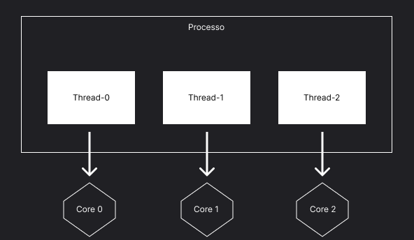
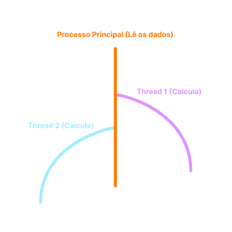
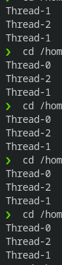
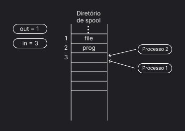
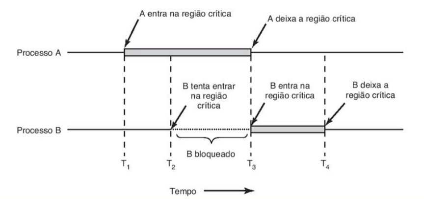
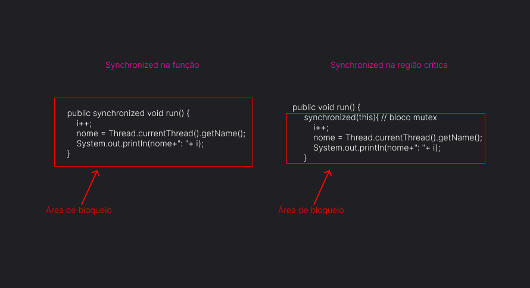

<h1 align="center">Um estudo sobre threads e java</h1>


<p>Este projeto têm como objetivo espalhar meu conhecimento sobre threads usando Java e um pouco de C, tratarei de citar e explicar sobre conceitos computacionais relacionados, tais como concorrencia, região critica e técnicas de exclusão mutua. Estes conceitos são dificeis de entender inicialmente, pois precisa-se de uma base de entendimento de sistemas operacionais, mas com este breve estudo, pretendo atiçar sua curiosidade e indicar novos estudos.</p>


<div align="center">
<br></br>
<h2>Tópicos</h2>

<p>Quem sou eu?</p>
<p>Um breve conceito sobre escalonadores</p>
<p>Threads</p>
<p>Criando threads com java</p>
<p>Condição de disputa</p>
<p>Região Crítica</p>
<p>Resolvendo os problemas de threads</p>
<p>Condições para promover uma boa solução exclusão mútua</p>
<p>Teoria do mutexes</p>
<p>Mutex na prática(linguagem C)</p>
<p>Utilizando mutex para resolver threads em Java</p>
<p>Usando synchronized</p>
<p>Synchronized em funções</p>
<p>O uso mais correto de synchronized(em produção)</p>
<p>Chegamos ao fim!</p>


</div>


<div id="quemsoueu" align="center">
<h2 align="center">Quem sou eu?</h2>


<p align="left"> Olá, meu nome é Henrique Liberato, atualmente sou estudante de Ciências da Computação no Instituto Federal de São Paulo - Campus Presidente Epitácio, meu foco atual é estudar Java em direção a uma carreira de dev, como engenheiro de software ou backend, sempre busquei entender bem os conceitos de computação, e com este pequeno projetinho pretendo passar um pouco do que eu sei.</p>
</div>

<div id="escalonadores">

<br></br>
<h2 align="center">Um breve conceito sobre escalonadores</h2>

<p>
De nada adianta falarmos de threads e seus pontos principais sem antes sabermos sobre escalonadores, pois são conceitos que se relacionam completamente , porém, falar de tudo sobre eles levaria um tempo enorme, poderiamos sentar em nossas cadeiras e ver a nossa vida passar enquanto lemos sobre, então levantarei tópicos resumidos sobre o assunto, visando apenas buscar pontos de relação de escalonadores com o assunto principal (Threads).
</p>

<p> Nos computadores atuais, que há diversos processos em execução ao mesmo tempo que competem pela CPU, dificilmente haverá espaço para todos, logo, há de escolher um para ser executado no momento, mas quem faz essa escolha? os escalonadores, usando de algum algoritmo de escalonamento, que nada mais é o metodo que ele usará para saber quem será o próximo a ser executado em uma fila de processos.</p>

<p>Há 3 categorias de escalonamento, Lote, Interativo, Tempo real, mas falarei pouco sobre os metodos pois o nosso foco é entender threads.</p>

- Algoritmos de escalonamento em **lote** não são usados com foco no usuário, logo, não há a necessidade de esperar por respostas, então o escalonador libera o processo para realizar seu trabalho de forma completa, sem atrasos

- Algoritmos de escalonamento **interativo** é usado quando há a usuários, ou seja, nós. Nele, a troca de processos é essencial, não podendo deixar um processo fazer oque quiser com o tempo que quiser, pois um usuário usa varias coisas ao mesmo tempo, então usa-se da troca rapida de processos para gerar uma sensação de que tudo está rodando em conjunto, quando na verdade, está tendo uma sequencia de diversas execuções de processos diferentes.

- Algoritmos de escalonamento em **Tempo real** têm uma semelhança com o Interativo, porém, não pode-se ter uma demora no tempo de execução de um processo, a diferença maior entre um de tempo real e interativo é que os de tempo real visa a execução de programas a mão.

</div>

<div align="center" id="threads">
<br></br>
<h2>Threads</h2>

<p align="left">Dado o grande avanço técnologico e a evolução de sistemas, tornou-se desejavel ter softwares que realizam mais ações ao mesmo tempo, de uma forma mais eficiente, trouxe a ideia de usar um processo dentro de outro, isto é, como se eles fossem processos separados, mas que compartilham o mesmo espaço de endereçamento.</p>




<p align="left">Mas... como que ocorre isso? Bom, imagine comigo um programa que faça leitura de contas bancárias e calcula seus gastos, cobranças, saldo, etc. Contas são grandes, há muitos dados a serem lidos e calculados, como podemos fazer as duas coisas ao mesmo tempo? criaremos um processo neste programa, onde o processo pai(gerador da thread) lê os dados e cria a thread(processo filho) para realizar os calculos, agora temos alguém calculando e outro lendo, e podemos ainda otimizar mais, criando mais threads, porém como tudo nessa vida, há problemas, que falaremos jajá.</p>


</div>

<div>
<h2 align="center">Criando threads com java</h2>

É muito simples criarmos threads com java, dado que já existem interfaces e funções prontas para seu uso, neste pequeno exemplo iremos ter duas classes: *ThreadBasica* e *Principal(Classe Main)*.


**ThreadBasica:** terá como função imprimir o nome da thread em que ela está.

``` 

public class ThreadBasica implements Runnable{
    
    private String nome;


    //O metodo run() é implementado pela interface Runnable

    @Override
    public void run() {
        nome = Thread.currentThread().getName();
        System.out.println(nome);
    }
    
}

```

**Principal**: terá como função criar threads e carrega-las.

```

public class Principal {


    public static void main(String[] args) throws Exception {
        ThreadBasica threadBasica = new ThreadBasica();
        Thread t1 =  new Thread(threadBasica);
        Thread t2 = new Thread(threadBasica);
        Thread t3 = new Thread(threadBasica);
        t1.start();
        t2.start();
        t3.start();
    }       
    
}

```

!*Vale ressaltar que os dois estão na pasta **src** do github.*

Ok.. tudo começa com a classe main instanciando uma nova **classe thread**, que detêm de diversas funções para a execução de uma thread, vale ressaltar que, utilizo o construtor da Thread passando o objeto/classe que eu desejo que execute em paralelo, neste caso, desejo que ela execute minha classe **ThreadBasica**, composto pela função run().

Com toda a preparação, devemos utilizar do metodo **start()**, que fará com que haja a criação de um processo em paralelo e executará a função que desejo. Como saída, teremos os nomes das threads, que por padrão, o nome é composto da palavra "Thread" + seu numero de execução, ou seja, começa-se do 0 e a cada nova criação é iterado 1.

**Saída esperada no console:**
```

Thread-0
Thread-1
Thread-2

```

Porém, podemos pensar que sempre teremos a mesma saída, começando da primeira thread que chamei, até a ultima, mas, devemos relembrar dos conceitos de escalonamento já ditos, o escalonador que dirá quem será executado primeiro, não nós meros mortais.., logo, podemos ter uma saída completamente diferente, com sua sequência embaralhada.

O escalonador pode parar uma thread de sua execução antes que ele possa imprimir na tela seu nome, e colocar outra thread para imprimir, e isso é um problema, pois uma está a todo momento **concorrendo** com a outra para ver quem irá executar sua função primeiro, podendo até mesmo sobrescrever algum dado compartilhado e tirando tudo de ordem, damos o nome de **"Condição de disputa"**. Veja um exemplo que aconteceu quando eu executei o programa algumas vezes:




Isto ocorre pois durante as suas execuções o escalonador está escolhendo quem irá primeiro e quem sairá depois de um tempo..causando a condição de disputa.
</div>

<div>
<h3 align="center">Condição de disputa</h3>

Condição de disputa nada mais é que a ocorrência de dois ou mais processos que estão tentando executar uma mesma função de tal forma que elas podem ser retiradas pelo escalonador para dar espaço a outra, ou seja, estão constantemente concorrendo por espaço, querendo executar sua função, já que todas têm o mesmo objetivo..

<div align="center">
 


</div>


Neste exemplo há o uso de uma impressora, com processos colocando arquivos para imprimir, os dois têm a mesma função, colocar o arquivo em memória utilizando de duas variáveis, **in e out**, in indicará aonde o arquivo deverá ser colocado e out o arquivo que está saindo, imagine agora que os dois processos estão utilizando das mesmas variaveis em condição de disputa, como vimos antes, o escalonador poderá parar um deles e indicar o outro para executar, porém, há chances de ocorrer que o processo anterior estava pronto para colocar um arquivo na memoria, mas não conseguiu, o outro processo entrará em execução e como a variável IN ainda está apontando para o mesmo lugar, colocará neste, e chamará o processo anterior, oque ocorre agora é que o processo anterior irá sobrescrever oque o outro colocou, causando perca de arquivos.

Dentro deste conceito, há outro, **Regiões Críticas**.

</div>

<div>
<br></br>
<h3 align="center">Região Crítica</h3>

Como explicado anteriormente, condição de disputa ocorre quando dois processos fazem a mesma função tendo as mesmas variáveis, regiões criticas são justamente estas partes de código que, **utilizam das mesmas varíaveis globais, podendo modifica-las ou lê-las**, ou seja, todos os problemas ocorridos até agora, acontece justamente por conta de que os processos estão modificando e lendo os dados de outros sem quaisquer regras, já que estes dados são globais, logo, disponíveis a todos.

Vamos usar como exemplo o código em java que fizemos:

```

public class ThreadBasica implements Runnable{
    private String nome;


    @Override
    public void run() {
        nome = Thread.currentThread().getName();
        System.out.println(nome);
    }
    
}

```

Todas as threads estarão neste mesmo local, trabalhando paralelamente e concorrendo umas com as outras com o objetivo de executar a função run(), temos como região critica justamente esta função, pois, a variável global **nome** está sendo **modificada** em uma linha, e na outra, **sendo lida**, então, um processo pode modificar seu valor, mas não imprimir pois o escalonador a retirou de execução, outro processo irá vir e irá também modificar seu valor, sobrescrevendo-o e com isso causando problemas se feitos em um software em uso.

</div>


<div>
<br></br>

<h2 align="center">Resolvendo os problemas de threads</h2>

Há diversas formas de resolver os problemas causados pelo uso de threads, feitos por autores diferentes, com formas high level(mais próximo da nossa linguagem) e low level(mais perto da linguagem de hardware), estas consistem na ideia de previnir com que dois processos/threads entrem na **região crítica** ao mesmo tempo, algumas tendo mais eficácia e outras menos...são chamadas de **técnicas de exclusão mutua**(sugiro pesquisar sobre as diversas técnicas existentes).


<h3 align="center">Condições para promover uma boa solução exclusão mútua</h3>

    1. Dois ou mais processos ou threads jamais podem estar simultaneamente dentro de suas regiões críticas;
    2. Nenhuma suposição pode ser feita a respeito de velocidades ou números de CPUs;
    3. Nenhum processo ou thread fora de sua região critica pode bloquear qualquer processo;
    4. Nenhum processo ou thread deve ser obrigado a esperar eternamente para entrar em sua região crítica.


<br></br>
<h3 align="center">Teoria do mutexes</h3>

Mutex é uma das técnicas de exclusão mutua, que consiste na ideia de termos uma variável que terá a função de permitir que alguém entre ou não naquela função/parte do código. Considerada uma forma mais usual de resolver, os mutexes trabalham não só como uma variável, pois se não, apenas criariamos uma variável qualquer em escopo global e usariamos..mas os mutexes trabalham realizando diversas mudanças em **assembly**, linguagem low level.

<div align="center">



(Foto extraída do livro Sistemas Operacionais Modernos 4°Ed. - Tanenbaum)

</div>

<br></br>

<h3 align="center">Mutex na prática(linguagem C)</h3>

Para quem já conhece C e quer entender o funcionamento de uma forma mais completa dos mutexes, deixarei dois códigos abaixo em C para você testar.

!Os códigos e arquivos .c estão também no github na pasta **threads_in_C**.


**Windows**

```

#include <stdio.h>
#include <windows.h>
#include <process.h>
#define TF 10000

int i = -1;
int vet[TF];

HANDLE mutex;

void produtor(void) {
    int pos, item;
    while(1) {
      WaitForSingleObject(mutex,INFINITE); // Uso do mutex para análisar se pode entrar ou não
      if (i<TF) {
        i++;
        pos=vet[i]=i;
        item=vet[i];
        ReleaseMutex(mutex); // Saída do mutex, abrindo o caminho para outro processo entrar
        printf("\nProd: posicao %05d - valor %05d",pos,item);
      }
      else {
        ReleaseMutex(mutex);
        SwitchToThread(); // Sai da região se não tiver nada para fazer(está no else);
      }
    }
}

void consumidor(void) {
    int pos, item;
    while(1) {
      WaitForSingleObject(mutex,INFINITE);
      if (i>-1) {
        item=vet[i];
        pos=i;
        vet[i]=-1;
        i--;
        ReleaseMutex(mutex);
        printf("\nCons: posicao %05d - valor %05d",pos,item);
      }
      else {
        ReleaseMutex(mutex);
        SwitchToThread();
      }
    }
}

void main(void)
{
    mutex=CreateMutex(NULL,FALSE,NULL);
    _beginthread(produtor,NULL,NULL); // Cria a thread para a função produtor
    _beginthread(consumidor,NULL,NULL); // Cria a thread para a função consumidor
    getch();
}


```

**Linux**

```

#include <stdio.h>
#include <stdlib.h>
#include <pthread.h>

#define TF 10000
#define MAXTHREADS 2

int i = -1;
int vet[TF];

pthread_mutex_t mutex;
pthread_t t[MAXTHREADS];

void* produtor(void *arg) {
    int pos, item;
    while(1) {
      pthread_mutex_lock(&mutex); // primeiro analisa se está aberto e entra(se disponivel), trancando o mutex
      if (i<TF) {
        i++;
        pos=vet[i]=i;
        item=vet[i];
        pthread_mutex_unlock(&mutex); // sai da região crítica, abrindo o mutex
        printf("\nProd: posicao %05d - valor %05d",pos,item);
      }
      else {
        pthread_mutex_unlock(&mutex);
	sched_yield();
      }
    }
}

void* consumidor(void *arg) {
    int pos, item;
    while(1) {
      pthread_mutex_lock(&mutex); // primeiro analisa se está aberto e entra(se disponivel), trancando o mutex
      if (i>-1) {
        item=vet[i];
        pos=i;
        vet[i]=0;
        i--;
        pthread_mutex_unlock(&mutex); // sai da região crítica, abrindo o mutex
        printf("\nCons: posicao %05d - valor %05d",pos,item);
      }
      else {
        pthread_mutex_unlock(&mutex);
	sched_yield();
      }	
    }
}

void main(void)
{
    pthread_mutex_init(&mutex, NULL); // inicia a varíavel mutex
    pthread_create(&t[0], NULL, &produtor, NULL); // cria a thread
    pthread_create(&t[1], NULL, &consumidor, NULL); // cria a thread
    pthread_join(t[0], NULL); // inicia a thread
    pthread_join(t[1], NULL); // inicia a thread
    pthread_mutex_destroy(&mutex); // o mutex é destruído no momento em que todas as threads terminarem
}

```

</div>

<br></br>

<div>
<h2 align="center">Utilizando mutex para resolver threads em Java</h2>

Abaixo veremos a principal forma de resolvermos nossos problemas com threads, primeiro demonstrarem algumas das formas que teremos, e depois a forma mais usual, geralmente mais adaptada ao uso em produção.

<h3 align="center">Usando synchronized</h3>

Synchronized é a forma mais convencional de nos proteger dos males do multithreading em java, ela é bem simples, apenas adicione ela na parte do seu código onde exista **região crítica**.

<h3 align="center">Synchronized em funções</h3>

Veremos agora o uso do mutex através de uma função, que, assim como dito, irá deixar a função bloqueada a partir do momento em que uma thread estiver dentro, logo, inibindo o erro de concorrencia. Usaremos para este exemplo o código feito no início do assunto e adicionaremos uma nova varíavel, i.

O objetivo da variável **i** será apenas para deixar o entendimento melhor, já que, apenas com o nome das threads, não irá de forma visual demonstrar a resolução, pois o escalonador pode troca-los..

``` 

public class ThreadBasica implements Runnable{
    private String nome;
    private int i=0;


    @Override
    public void run() {
        i++;
        nome = Thread.currentThread().getName();
        System.out.println(nome+": "+ i);
    }
    
}

```

Rodando o código acima temos como saída:

```

Thread-1: 2
Thread-2: 3
Thread-1: 2

```
Ou seja, sem o uso de mutex temos o erro já visto antes, onde há concorrencia entre os processos..


Pense por um momento, aonde que há região crítica dentro deste bloco de código...

Achou? isso mesmo, está justamente na **função run**, pois, temos como parte dela, o uso de uma variável global **nome** e **i**, que será usada por todos os processos que têm esta função..Adicionaremos agora o synchronized e veremos como ela se comporta no terminal..

``` 

public class ThreadBasica implements Runnable{
    private String nome;
    private int i=0;


    @Override
    public synchronized void run() {
        i++;
        nome = Thread.currentThread().getName();
        System.out.println(nome+": "+ i);
    }
    
}

```

Temos como saída:

```

Thread-0: 1
Thread-2: 2
Thread-1: 3

```

Por mais que o nome das threads estejam trocados, a varíavel **i** está em sequencia, pois o primeiro que entrar captura seu valor e a mostra na sequencia correta, indenpendente de qual thread a pegou, pois quem decide qual irá entrar em execução primeiro é o **escalonador**.

<br></br>

<h3 align="center">O uso mais correto de synchronized(em produção)</h3>

Conseguimos então resolver o nosso problema, mas, será aquele método o mais correto? Não... Pensaremos o seguinte, a vantagem do uso de mais processos é justamente faze-las trabalharem juntas agilizando alguma função dentro de um programa, logo, ao inibirmos a entrada dos outros processos dentro da mesma função, acaba retirando esta vantagem e tornando inútil o uso de threads.

Refinaremos agora o nosso uso de mutex dentro dos nóssos códigos, a partir do momento em que conseguimos identificar uma região crítica, devemos apenas bloquear a região crítica e não todo seu contorno...mas como assim? Faremos agora um bloco onde só ali poderá entrar um por vez, e toda sua região em volta ainda poderá entrar mais de uma thread, que farão outros serviços e etc..

```

public class ThreadBasica implements Runnable{
    private String nome;
    private int i=0;


    @Override
    public void run() {
        synchronized(this){ // bloco mutex
            i++;
            nome = Thread.currentThread().getName();
            System.out.println(nome+": "+ i);
        }  
    }
    
}

```

Agora, habilitamos as threads de entrarem dentro de sua área de execução (o run()) mas não entrarem juntas na região crítica, olhando apenas para um código simples podemos pensar que as duas formas farão o mesmo, mas não, pois agora podemos escrever mais códigos embaixo ou encima deste bloco e todas as threads trabalharão, enquanto a parte especifica é bloqueada, então deixamos de inibir o trabalho total das threads.

<div align="center">




</div>
</div>

<div>
<h2 align="center">Chegamos ao fim!</h2>

Muito obrigado a você que leu até o fim, e meus parabêns!, chegar até aqui significa que você é alguêm motivado e que deseja saber mais sobre o mundo da computação e performance de código!!

Estarei deixando algumas ideias de tópicos para ler mais sobre e evoluir no entendimento sobre sistemas operacionais:

**Tópicos sobre OS:**

- Exclusão mútua com espera ocupada (Desabilitando interrupções, Variáveis do tipo Trava, Alternância explicita e Solução de Peterson). 

- Exclusão mútua com espera ocupada (Instrução TSL/XCHG). Mutexes e Semáforos.

- Criação de processos com fork e exec

- Arquiteturas de Sistemas Operacionais

**Tópicos relacionados com Java:**
- locks (outra forma além do synchronized)
</div>


