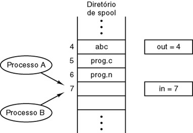

<h1 align="center">Um estudo sobre threads e java</h1>

<p>Este projeto têm como objetivo espalhar meu conhecimento sobre threads usando Java e um pouco de C, tratarei de citar e explicar sobre conceitos computacionais relacionados, tais como concorrencia, região critica e técnicas de exclusão mutua. Estes conceitos são dificeis de entender inicialmente, pois precisa-se de uma base de entendimento de sistemas operacionais, mas com este breve estudo, pretendo atiçar sua curiosidade e indicar novos estudos.</p>


<div align="center">
<h2>Sumário</h2>


</div>


<div id="quemsoueu" align="center">
<h2 align="center">Quem sou eu?</h2>


<p align="left"> Olá, meu nome é Henrique Liberato, atualmente sou estudante de Ciências da Computação no Instituto Federal de São Paulo - Campus Presidente Epitácio, meu foco atual é estudar Java em direção a uma carreira de dev, como engenheiro de software ou backend, sempre busquei entender bem os conceitos de computação, e com este pequeno projetinho pretendo passar um pouco do que eu sei.</p>
</div>

<div id="escalonadores">
<h2 align="center">Um breve conceito sobre escalonadores</h2>

<p>
De nada adianta falarmos de threads e seus pontos principais sem antes sabermos sobre escalonadores, pois são conceitos que se relacionam completamente , porém, falar de tudo sobre eles levaria um tempo enorme, poderiamos sentar em nossas cadeiras e ver a nossa vida passar enquanto lemos sobre, então levantarei tópicos resumidos sobre o assunto, visando apenas buscar pontos de relação de escalonadores com o assunto principal (Threads).
</p>

<p> Nos computadores atuais, que há diversos processos em execução ao mesmo tempo que competem pela CPU, dificilmente haverá espaço para todos, logo, há de escolher um para ser executado no momento, mas quem faz essa escolha? os escalonadores, usando de algum algoritmo de escalonamento, que nada mais é o metodo que ele usará para saber quem será o próximo a ser executado em uma fila de processos.</p>

<p>Há 3 categorias de escalonamento, Lote, Interativo, Tempo real, mas falarei pouco sobre os metodos pois o nosso foco é entender threads.</p>

- Algoritmos de escalonamento em **lote** não são usados com foco no usuário, logo, não há a necessidade de esperar por respostas, então o escalonador libera o processo para realizar seu trabalho de forma completa, sem atrasos

- Algoritmos de escalonamento **interativo** é usado quando há a usuários, ou seja, nós. Nele, a troca de processos é essencial, não podendo deixar um processo fazer oque quiser com o tempo que quiser, pois um usuário usa varias coisas ao mesmo tempo, então usa-se da troca rapida de processos para gerar uma sensação de que tudo está rodando em conjunto, quando na verdade, está tendo uma sequencia de diversas execuções de processos diferentes.

- Algoritmos de escalonamento em **Tempo real** têm uma semelhança com o Interativo, porém, não pode-se ter uma demora no tempo de execução de um processo, a diferença maior entre um de tempo real e interativo é que os de tempo real visa a execução de programas a mão.

</div>

<div align="center" id="threads">
<h2>Threads</h2>

<p align="left">Dado o grande avanço técnologico e a evolução de sistemas, tornou-se desejavel ter softwares que realizam mais ações ao mesmo tempo, de uma forma mais eficiente, trouxe a ideia de usar um processo dentro de outro, isto é, como se eles fossem processos separados, mas que compartilham o mesmo espaço de endereçamento.</p>


(Foto extraída do treina web)

<p align="left">Mas... como que ocorre isso? Bom, imagine comigo um programa que faça leitura de contas bancárias e calcula seus gastos, cobranças, saldo, etc. Contas são grandes, há muitos dados a serem lidos e calculados, como podemos fazer as duas coisas ao mesmo tempo? criaremos um processo neste programa, onde o processo pai(gerador da thread) lê os dados e cria a thread(processo filho) para realizar os calculos, agora temos alguém calculando e outro lendo, e podemos ainda otimizar mais, criando mais threads, porém como tudo nessa vida, há problemas, que falaremos jajá.</p>


</div>

<div>
<h2 align="center">Criando threads com java</h2>

É muito simples criarmos threads com java, dado que já existem interfaces e funções prontas para seu uso, neste pequeno exemplo iremos ter duas classes: *ThreadBasica* e *Principal(Classe Main)*.


**ThreadBasica:** terá como função imprimir o nome da thread em que ela está.

``` 

public class ThreadBasica implements Runnable{
    
    private String nome;


    //O metodo run() é implementado pela interface Runnable

    @Override
    public void run() {
        nome = Thread.currentThread().getName();
        System.out.println(nome);
    }
    
}

```

**Principal**: terá como função criar threads e carrega-las.

```

public class Principal {


    public static void main(String[] args) throws Exception {
        ThreadBasica threadBasica = new ThreadBasica();
        Thread t1 =  new Thread(threadBasica);
        Thread t2 = new Thread(threadBasica);
        Thread t3 = new Thread(threadBasica);
        t1.start();
        t2.start();
        t3.start();
    }       
    
}

```

!*Vale ressaltar que os dois estão na pasta **src** do github.*

Ok.. tudo começa com a classe main instanciando uma nova **classe thread**, que detêm de diversas funções para a execução de uma thread, vale ressaltar que, utilizo o construtor da Thread passando o objeto/classe que eu desejo que execute em paralelo, neste caso, desejo que ela execute minha classe **ThreadBasica**, composto pela função run().

Com toda a preparação, devemos utilizar do metodo **start()**, que fará com que haja a criação de um processo em paralelo e executará a função que desejo. Como saída, teremos os nomes das threads, que por padrão, o nome é composto da palavra "Thread" + seu numero de execução, ou seja, começa-se do 0 e a cada nova criação é iterado 1.

**Saída esperada no console:**
```

Thread-0
Thread-1
Thread-2

```

Porém, podemos pensar que sempre teremos a mesma saída, começando da primeira thread que chamei, até a ultima, mas, devemos relembrar dos conceitos de escalonamento já ditos, o escalonador que dirá quem será executado primeiro, não nós meros mortais.., logo, podemos ter uma saída completamente diferente, com sua sequência embaralhada.

O escalonador pode parar uma thread de sua execução antes que ele possa imprimir na tela seu nome, e colocar outra thread para imprimir, e isso é um problema, pois uma está a todo momento **concorrendo** com a outra para ver quem irá executar sua função primeiro, podendo até mesmo sobrescrever algum dado compartilhado e tirando tudo de ordem, damos o nome de **"Condição de disputa"**. Veja um exemplo que aconteceu quando eu executei o programa algumas vezes:


Isto ocorre pois durante as suas execuções o escalonador está escolhendo quem irá primeiro e quem sairá depois de um tempo..causando a condição de disputa.
</div>

<div>
<h3 align="center">Condição de disputa</h3>

Condição de disputa nada mais é que a ocorrência de dois ou mais processos que estão tentando executar uma mesma função de tal forma que elas podem ser retiradas pelo escalonador para dar espaço a outra, ou seja, estão constantemente concorrendo por espaço, querendo executar sua função, já que todas têm o mesmo objetivo..

<div align="center">



</div>

Neste exemplo há o uso de uma impressora, com processos colocando arquivos para imprimir, os dois têm a mesma função, colocar o arquivo em memória utilizando de duas variáveis, **in e out**, in indicará aonde o arquivo deverá ser colocado e out o arquivo que está saindo, imagine agora que os dois processos estão utilizando das mesmas variaveis em condição de disputa, como vimos antes, o escalonador poderá parar um deles e indicar o outro para executar, porém, há chances de ocorrer que o processo anterior estava pronto para colocar um arquivo na memoria, mas não conseguiu, o outro processo entrará em execução e como a variável IN ainda está apontando para o mesmo lugar, colocará neste, e chamará o processo anterior, oque ocorre agora é que o processo anterior irá sobrescrever oque o outro colocou, causando perca de arquivos.

Dentro deste conceito, há outro, **Regiões Críticas**.

</div>

<div>
<h3 align="center">Região Crítica</h3>

Como explicado anteriormente, condição de disputa ocorre quando dois processos fazem a mesma função tendo as mesmas variáveis, regiões criticas são justamente estas partes de código que, **utilizam das mesmas varíaveis globais, podendo modifica-las ou lê-las**, ou seja, todos os problemas ocorridos até agora, acontece justamente por conta de que os processos estão modificando e lendo os dados de outros sem quaisquer regras, já que estes dados são globais, logo, disponíveis a todos.

Vamos usar como exemplo o código em java que fizemos:

```

public class ThreadBasica implements Runnable{
    private String nome;


    @Override
    public void run() {
        nome = Thread.currentThread().getName();
        System.out.println(nome);
    }
    
}

```

Todas as threads estarão neste mesmo local, trabalhando paralelamente e concorrendo umas com as outras com o objetivo de executar a função run(), temos como região critica justamente esta função, pois, a variável global **nome** está sendo **modificada** em uma linha, e na outra, **sendo lida**, então, um processo pode modificar seu valor, mas não imprimir pois o escalonador a retirou de execução, outro processo irá vir e irá também modificar seu valor, sobrescrevendo-o e com isso causando problemas se feitos em um software em uso.

</div>


<div>
<h2 align="center">Resolvendo os problemas de threads</h2>


</div>


